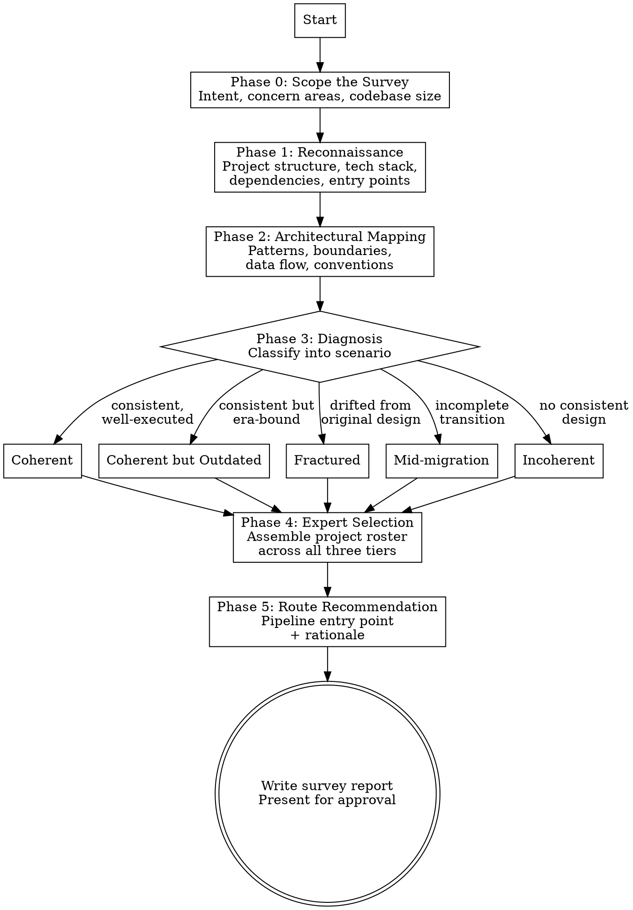

# Site Survey

## Overview

Evaluates an existing codebase before work begins — the construction industry equivalent of surveying a site before renovation. Explores the architecture, identifies patterns, frameworks, and conventions in use, diagnoses the codebase's structural state, selects and locks in grounding experts based on what is found, and recommends the appropriate GVM pipeline entry point.

**Pipeline position:** **`/gvm-site-survey`** → `/gvm-requirements` | `/gvm-tech-spec` | `/gvm-build` (routing depends on diagnosis)

This is the entry point for existing codebases. Greenfield projects skip this and begin with Expert Calibration → `/gvm-requirements`.

**This skill produces a diagnosis and expert roster only.** It does not write requirements, specs, or code. Those belong to downstream commands.

**Shared rules:** At the start of this skill, load `~/.claude/skills/gvm-design-system/references/shared-rules.md` and follow all rules throughout execution. Load `~/.claude/skills/gvm-design-system/references/expert-scoring.md` when scoring experts.

## Hard Gates

1. **LOAD EXPERT REFERENCES AT SESSION START.** Read `architecture-specialists.md`, relevant domain specialist files from `~/.claude/skills/gvm-design-system/references/domain/`, and `stack-specialists.md` BEFORE beginning the survey. The survey is an expert-guided assessment, not a mechanical file scan. Load domain files selectively based on what the codebase appears to contain. See `~/.claude/skills/gvm-design-system/references/domain-specialists.md` index for the full list of available domain files and their activation signals.

2. **READ ACTUAL CODE.** The survey must read actual source files — not just list directories and guess. Every architectural claim in the report must be backed by a file you read. If you describe a pattern without having read the code that implements it, you are hallucinating.

3. **WRITE PAIRED HTML + MD OUTPUT.** Both files must be written.

4. **EXPERT ROSTER TABLE IS MANDATORY.** The output must include a "Recommended Project Experts" table in section 9 of the survey report. Downstream skills (`/gvm-requirements`, `/gvm-tech-spec`) read this table to know which experts are active. If it is missing, downstream skills cannot assemble their expert panels.

5. **HTML BEFORE APPROVAL.** Write the survey MD file first, then IMMEDIATELY write the HTML file. Both must exist before presenting the survey for user review.

## Expert Panel

This skill uses two distinct sets of experts:

1. **Diagnostic experts** — loaded at the start to *conduct* the survey. These guide what to look for during Phases 1–3. They are logged as `loaded` and `cited` in the activation CSV during the survey itself.
2. **Project experts** — assembled as *output* of the survey in Phase 4. These are the experts recommended for downstream pipeline phases based on what the codebase revealed. They are not loaded during the survey — they are activated when a downstream skill (e.g. `/gvm-requirements`, `/gvm-tech-spec`) runs.

**Diagnostic experts (always active during survey):**

Load the diagnostic domain specialist files from `~/.claude/skills/gvm-design-system/references/domain/` at the start of the survey: `domain/refactoring.md` (role: pattern recognition), `domain/legacy-code.md` (role: legacy assessment), `domain/data-intensive.md` (role: data layer diagnosis), and `domain/service-boundaries.md` (role: boundary assessment). These experts guide what to look for. The codebase determines which project experts get locked in for downstream phases. These experts are loaded once at the start of Phase 1 and remain in context through Phase 3. If context is compacted between phases, reload the files.
Log all loaded experts to activation CSV (per shared rule 1).

## Process Flow

## Process Flow (text)

Before Phase 1: Bootstrap GVM home directory per shared rule 14.

1. SCOPE THE SURVEY — establish intent, concern areas, codebase size with the user
2. RECONNAISSANCE — read directory structure, package files, configs, tech stack, test infrastructure, git archaeology, existing documentation
3. ARCHITECTURAL MAPPING — identify patterns, modules, boundaries, data flow, conventions
4. DIAGNOSIS — score 6 dimensions (Coherence, Currency, Testability, Modularity, Documentation, Dependency Health) and classify into one of 5 scenarios (Coherent, Coherent but Outdated, Fractured, Mid-migration, Incoherent)
5. EXPERT SELECTION — assemble project roster across all three tiers using roster-assembly.md, driven by what the codebase revealed
6. ROUTE RECOMMENDATION — recommend pipeline entry point based on diagnosis and work type, present to user with rationale
7. WRITE REPORT — output paired HTML + MD to site-survey/site-survey-{NNN}.html and .md

## Phase Details

### Phase 0 — Scope the Survey

Before exploring, establish boundaries with the user:

- **What is the intended work?** A feature addition, a remediation effort, a modernisation, an audit? This shapes what to look for.
- **Is there a specific area of concern?** The user may already know where the problems are. Start there.
- **How large is the codebase?** For very large codebases (100k+ lines), agree on which modules or services to survey rather than attempting the whole system.

Use AskUserQuestion for scoping decisions.

### Phase 1 — Reconnaissance

Systematic exploration of the codebase structure. Use Glob, Grep, Read, and Bash tools to gather facts.

**1.1 Project Structure**
- Directory layout — identify the organisational pattern (by feature, by layer, by domain, monorepo with packages)
- Entry points — main files, server bootstrap, CLI entry points
- Configuration files — build tools, linters, formatters, CI/CD, Docker, infrastructure-as-code

**1.2 Tech Stack**
- Languages and versions — `package.json`, `pyproject.toml`, `go.mod`, `Cargo.toml`, `Gemfile`, etc.
- Frameworks — web frameworks, ORM/database layers, testing frameworks, UI frameworks
- Key dependencies — list the significant libraries (not every transitive dependency)

**1.3 Test Infrastructure**
- Test directories, test runner configuration
- Approximate test coverage — are there tests at all? Unit only? Integration? E2E?
- Test patterns in use — AAA, BDD, fixtures, mocks

**1.4 Git Archaeology**
- `git log --oneline -30` — recent activity, commit message patterns, number of contributors
- `git log --format='%aN' | sort -u` — contributor count and names
- `git log --diff-filter=M --name-only --pretty=format: | sort | uniq -c | sort -rn | head -20` — most frequently modified files (hotspots)
- `git log --since="1 year ago" --oneline | wc -l` — activity level

If any git command fails (e.g., shallow clone, no tags, no history), note "Git archaeology incomplete — [reason]" in the survey report and continue. Git data is diagnostic context, not a prerequisite for the survey.

**1.5 Size and Scope**
- Line counts by language (use `find` + `wc` or `cloc` if available)
- Number of modules/packages/services
- External API integrations — look for HTTP clients, SDK imports, API key references

**1.6 Existing Documentation**

Scan for project documentation that could serve as seed input for pipeline phases. Document naming varies across organisations — a "functional spec" is requirements, a "technical design document" is a spec, a "QA plan" is test cases. **Classify by content, not filename.**

Scan locations: `docs/`, `wiki/`, `requirements/`, `specs/`, `test-cases/`, `tests/`, `adr/`, `decisions/`, and any markdown, Word, PDF, or HTML files in the project root or common documentation directories.

For each document found, read the first page or section to classify it:

| GVM category | Common names in the wild |
|---|---|
| **Requirements** | PRD, functional spec, BRD, user stories, feature requests, MRD, product brief, use cases, acceptance criteria doc |
| **Test cases** | QA plan, test plan, test matrix, test suite, acceptance tests, UAT scripts, verification plan |
| **Technical spec** | Architecture doc, technical design doc, TDD, system design, HLD, LLD, API spec (OpenAPI/Swagger), ADRs, design decisions |
| **Other** | Runbooks, onboarding guides, operational docs, deployment guides — useful context but not pipeline seed input |

For each document, note: file path, format, approximate size, last modified date, and **GVM category classification**. These existing artefacts are important context for the route recommendation — if the project already has requirements or specs, the downstream pipeline phases can use them as seed input rather than starting from scratch.

Present a structured summary of findings to the user before proceeding to Phase 2.

### Phase 2 — Architectural Mapping

Deeper analysis guided by the diagnostic experts. Read representative files, not every file.

**2.1 Pattern Identification** (use the pattern recognition expert from the diagnostic panel)
- What architectural pattern is in use? MVC, hexagonal, clean architecture, event-driven, CQRS, microservices, monolith, serverless?
- Are enterprise patterns visible? Repository, Unit of Work, Domain Model, Transaction Script, Active Record?
- Is there a consistent pattern, or do different parts of the codebase follow different patterns?

**2.2 Boundary Assessment** (use the boundary assessment expert from the diagnostic panel)
- How is the codebase modularised? Clear module boundaries with defined interfaces, or tangled dependencies?
- Are there service boundaries? How do services communicate?
- What is the coupling level? Can you change one module without touching others?

**2.3 Data Layer Diagnosis** (use the data layer expert from the diagnostic panel)
- What database(s) and storage systems are in use?
- What ORM or data access patterns? Raw SQL, query builder, full ORM, document store client?
- Is there a caching layer? What strategy?
- How does data flow through the system?

**2.4 Legacy Assessment** (use the legacy assessment expert from the diagnostic panel)
- What is the testability? Can components be instantiated in isolation?
- Where are the seams — places where behaviour can be altered without editing code?
- What is the change risk? Which areas are most coupled and least tested?
- Are there characterisation tests (tests that document current behaviour rather than desired behaviour)?

**2.5 Convention Audit**
- Naming conventions — consistent? Mixed? (camelCase vs snake_case in the same layer)
- Error handling patterns — consistent strategy or ad hoc?
- Logging — structured, unstructured, or absent?
- Code style — does it follow the language's community conventions?

Present the architectural map to the user. Flag any areas of uncertainty — "I'm reading this module as a repository pattern, but it also has business logic mixed in. Can you confirm?"

### Phase 3 — Diagnosis

The diagnosis has two parts: a **scored assessment** across multiple dimensions, and a **scenario classification** that emerges from the pattern of scores.

**3.1 Scored Dimensions**

Score each dimension on a 1–5 scale based on the evidence from Phases 1 and 2. Present the scores as a table in the survey report.

| Dimension | 1 (Low) | 5 (High) | What to look for |
|-----------|---------|----------|------------------|
| **Coherence** | Fragmented — multiple conflicting patterns | Coherent — one consistent approach throughout | Pattern consistency across modules, naming conventions, architectural style |
| **Currency** | Dated — patterns reflect a previous era | Modern — follows current best practices for the stack | Language idioms, framework versions, async patterns, dependency age |
| **Testability** | Untestable — tightly coupled, no seams | Well-tested — isolated components, comprehensive suite | Test coverage, test patterns, ability to instantiate components in isolation |
| **Modularity** | Tangled — changes ripple across the codebase | Modular — clear boundaries, defined interfaces | Coupling between modules, dependency direction, ability to change one area without touching others |
| **Documentation** | Opaque — intent unclear from code alone | Self-documenting — clear naming, ADRs, inline rationale | Naming quality, presence of ADRs or design docs, comment quality (not quantity) |
| **Dependency Health** | Abandoned — outdated, vulnerable, unmaintained deps | Current — actively maintained, no known vulnerabilities | Dependency age, known CVEs, maintenance status of key libraries |
| **Usability** *(conditional — UI codebases only)* | Poor — inconsistent interaction patterns, no accessibility, broken responsive behaviour | Strong — consistent UX conventions, accessible, responsive, clear navigation | Activate when Phase 1 detects a frontend framework, templates, or views. Assess: interaction pattern consistency, accessibility (ARIA, keyboard nav), responsive behaviour, form design, error presentation, navigation clarity. Omit for CLI tools, backend services, and libraries with no UI. |

For mixed codebases, score each area separately. A well-designed core might score 4–5 on coherence while a bolted-on reporting module scores 1–2.

**3.2 Scenario Classification**

The five scenarios emerge from the score patterns:

**Scenario 1: Coherent**
- Score pattern: high coherence (4–5), scores generally balanced
- Evidence: consistent patterns throughout, clear module boundaries, conventions followed, tests present and meaningful
- The codebase follows a well-executed design. New work should extend it.
- Typical cause: strong original team, maintained discipline over time

**Scenario 2: Coherent but Outdated**
- Score pattern: high coherence (4–5), low currency (1–2)
- Evidence: internally consistent patterns, but those patterns reflect an earlier era of best practice. The framework or language idioms have moved on.
- The design was sound for its time. Modernisation should be deliberate, not piecemeal.
- Typical cause: system built 5+ years ago by a competent team, not significantly refactored since
- Examples: callback-based async when the language now supports async/await, monolithic structure when the scale now demands decomposition, jQuery-era frontend patterns, pre-TypeScript JavaScript

**Scenario 3: Fractured**
- Score pattern: low coherence (1–3), other scores mixed
- Evidence: traces of an original coherent design, but deviations accumulate over time. Multiple conventions coexist. Some modules follow the pattern, others don't. Hotspot files have been modified by many contributors.
- The original design drifted through accumulated quick fixes and feature bolts.
- Typical cause: many developers over many years, no architectural stewardship, deadline pressure

**Scenario 4: Mid-migration**
- Score pattern: bimodal coherence (some areas 4–5, others 1–2), currency split between old and new
- Evidence: two distinct patterns coexist with a clear directional intent. Part of the codebase has been modernised, part hasn't. There may be adapter layers, compatibility shims, or bridge code.
- A deliberate migration was started but not completed.
- Typical cause: team turnover during modernisation, migration deprioritised, new urgent work overtook the rewrite
- Examples: half REST / half GraphQL, partial TypeScript migration, monolith with some extracted microservices, ORM migration in progress

**Scenario 5: Incoherent**
- Score pattern: low across most dimensions (1–2), especially coherence and modularity
- Evidence: no consistent pattern across the codebase. Each module or feature appears to have been built in isolation with different conventions. No discernible architectural intent.
- The system was never well-designed.
- Typical cause: built under extreme deadline pressure, by teams without architectural guidance, or by many contractors with no shared standards

**Mixed scenarios:** A large codebase may have different diagnoses for different areas. A well-designed core with an incoherent reporting module, for example. Score and diagnose each area separately.

Present both the scores and the scenario classification to the user via AskUserQuestion — "Based on my analysis, here are the scores: [...]. This pattern suggests [scenario]. Does this match your experience?" The user's domain knowledge may override or refine the diagnosis.

### Phase 4 — Expert Selection

Load `~/.claude/skills/gvm-design-system/references/roster-assembly.md` and run the shared roster assembly process with site-survey inputs:
- **Business domain:** identified from the codebase (configuration, domain models, business logic, naming)
- **Tech stack:** identified in Phase 1 (languages, frameworks, key dependencies)
- **Codebase state:** the scenario classification from Phase 3 (Coherent → Incoherent)
- **Software patterns:** identified in Phase 2 (data-intensive, event-driven, service-oriented, etc.)

The roster assembly process handles all tiers (1, 2a, 2b, 3), expert discovery (mandatory for site-survey), automatic scoring, and roster presentation. The scenario classification drives Tier 1 expert selection:

| Scenario | Expert Selection Emphasis |
|----------|--------------------------|
| Coherent | Decision capture, risk-calibrated depth |
| Coherent but Outdated | Refactoring, boundary extraction, conceptual integrity |
| Fractured | Refactoring, legacy techniques, quality attribute restoration |
| Mid-migration | Migration patterns, strangler fig, seam identification |
| Incoherent | Architecture establishment, structure definition, conceptual integrity |

### Phase 5 — Route Recommendation

Recommend where to enter the GVM pipeline based on two factors: the **diagnosis** (what state the codebase is in) and the **nature of the intended work** (what the user wants to do).

**5.1 Work Type Assessment**

Before recommending a route, classify the intended work:

| Work Type | Description | Requirements needed? |
|-----------|-------------|---------------------|
| **User-facing feature** | New functionality that changes what users experience | Yes — always needs `/gvm-requirements` to understand user needs |
| **Technical remediation** | Refactoring, pattern consolidation, debt reduction, modernisation | No — the survey itself defines the problem and the target state. Go to `/gvm-tech-spec` directly. |
| **Targeted fix** | Small, well-understood change in a healthy codebase | No — go to `/gvm-build` directly |
| **Needs deeper investigation** | Survey reveals areas of concern but the scope or severity is unclear | Route to `/gvm-doc-review` on specific areas before deciding |

**5.2 Route Matrix**

The route depends on both the scenario and the work type:

| Scenario | User-facing feature | Technical remediation | Targeted fix | Unclear scope |
|----------|--------------------|-----------------------|--------------|---------------|
| Coherent | `/gvm-requirements` | `/gvm-tech-spec` | `/gvm-build` | `/gvm-doc-review` |
| Coherent but Outdated | `/gvm-requirements` | `/gvm-tech-spec` | `/gvm-tech-spec` | `/gvm-doc-review` |
| Fractured | `/gvm-requirements` | `/gvm-tech-spec` | `/gvm-tech-spec` | `/gvm-doc-review` |
| Mid-migration | `/gvm-requirements` | `/gvm-tech-spec` | `/gvm-tech-spec` | `/gvm-doc-review` |
| Incoherent | `/gvm-requirements` | `/gvm-requirements` | `/gvm-tech-spec` | `/gvm-doc-review` |

**Key insight:** For technical remediation work (refactoring, modernisation, pattern consolidation), the survey report itself serves as the requirements document. It has already defined what the codebase *is*, what it *should be*, and where the gaps are. Routing through `/gvm-requirements` would be ceremony for the sake of ceremony — there are no user needs to elicit.

The exception is **incoherent + technical remediation**, where the target architecture needs to be defined from scratch — this is significant enough to warrant a requirements phase even without user-facing features.

**5.3 The `/gvm-doc-review` route**

When the survey identifies areas of concern but the severity or scope is unclear, recommend `/gvm-doc-review` as an intermediate step before committing to a remediation path. The survey identifies *where* the issues are; `/gvm-doc-review` assesses *how bad* they are with deeper expert evaluation. This is particularly useful when:

- Multiple areas scored low but the user needs to prioritise which to address first
- The survey flagged potential issues but could not confirm them from static analysis alone
- The user wants a second opinion on the diagnosis before committing to a costly remediation

**5.4 Existing Documentation as Seed Input**

If Phase 1.6 found existing requirements, test cases, or specification documents, include them in the route recommendation. These documents should be fed as seed input to the corresponding pipeline phase rather than discarded:

- **Existing requirements found** → recommend `/gvm-requirements` with the document as seed. The skill will extract, refine, and verify against the source.
- **Existing test cases found** → recommend `/gvm-test-cases` with the document as seed, after requirements are in place.
- **Existing specs or architecture docs found** → recommend `/gvm-tech-spec` with the document as seed, after requirements and test cases are in place.
- **Multiple document types found** → recommend feeding each into its corresponding phase in pipeline order. The existing documents accelerate each phase without skipping the GVM quality process.

Present the discovered documents to the user with a summary: "I found N existing documents that can accelerate the pipeline. Each will be used as seed input — refined through the GVM process and verified against the original for completeness and accuracy."

Present the recommendation with rationale. The user decides — the survey recommends, it does not mandate.

## Output

The survey produces two files:

**Output location:** `site-survey/` directory in the current project. Each run produces a new numbered pair — previous surveys are never overwritten.

- First run: `site-survey/site-survey-001.html` and `site-survey/site-survey-001.md`
- Second run: `site-survey/site-survey-002.html` and `site-survey/site-survey-002.md`
- And so on.

Before writing, scan `site-survey/` for existing files and increment the counter. This preserves the history for before-and-after comparisons across remediation work.

### Document Structure

1. **Executive Summary** — one-paragraph diagnosis, scenario classification, recommended entry point
2. **Codebase Profile** — tech stack, size, structure, activity level, contributor count
3. **Architectural Map** — patterns identified, module boundaries, data flow, conventions
4. **Health Scorecard** — the scored dimensions (Coherence, Currency, Testability, Modularity, Documentation, Dependency Health, and Usability if a UI is present) presented as a visual table with 1–5 scores. For mixed codebases, show per-area scores.
5. **Diagnosis** — scenario classification with supporting evidence, showing how the score pattern maps to the scenario
6. **Risk Areas** — hotspots, high-coupling zones, untested areas, areas of concern (prioritised as Critical / Important / Minor)
7. **Diagnostic Experts Used** — which experts were loaded to conduct this survey, what role each played (pattern recognition, legacy assessment, data layer, boundary assessment), and which were cited in the diagnosis
8. **Expert Coverage Assessment** — the output of the Expert Discovery and Persistence Process: which technologies, patterns, and domains are covered by existing experts (name the expert and reference file), which have gaps, and what was done about each gap (expert discovered, scored, added — or gap acknowledged)
9. **Recommended Project Experts** — the assembled three-tier expert panel recommended for downstream pipeline phases, with a summary table: expert name, work, tier, classification, reference file, status (existing / newly added)
10. **Route Recommendation** — recommended pipeline entry point based on both the diagnosis and the work type, with rationale
11. **Open Questions** — anything the survey could not determine from code alone

Log cited experts to activation CSV (per shared rule 1).

### HTML Design

**HTML generation:** Dispatch the HTML report generation as a Haiku subagent (`model: haiku`). Per shared rule 22.

Follow the shared Tufte/Few design system. Use the Read tool to load `~/.claude/skills/gvm-design-system/references/tufte-html-reference.md` before the first write.

Key elements for the survey report:
- Floating TOC on the left
- Sidenotes for expert citations and evidence references
- **Health Scorecard** — a visual table or bar chart showing the dimension scores (1–5). Use colour coding: 4–5 green, 3 amber, 1–2 red. For mixed codebases, show per-area scores as rows. Include Usability only when a UI layer is present.
- Colour-coded scenario badge in the executive summary
- Risk areas as a prioritised table (Critical / Important / Minor — same tiers as `/gvm-doc-review`)
- Diagnostic experts as a table showing which experts were loaded for the survey, their role, and whether they were cited in the diagnosis
- Recommended project experts as a structured table with tier, activation rationale, and whether they are existing (from reference files) or newly discovered
- Route recommendation with work-type classification

### Markdown Design

Mirrors the HTML content exactly:
- Same sections, same order
- Sidenotes as `> blockquote`
- Designed for Claude consumption in downstream commands — the recommended project experts section is the key input for `/gvm-requirements`, `/gvm-tech-spec`, and `/gvm-build`

## Context Window Management

- Phase 1 uses broad, shallow reads — directory listings, config files, dependency files. Do not read entire source files.
- Phase 2 reads representative files — one or two examples per module/pattern, not every file.
- For large codebases, use Grep to identify patterns rather than reading files end-to-end.
- Present findings incrementally — don't accumulate the entire analysis in memory before writing (per shared rule 18).
- Write the report as sections are completed, using Edit for updates.

## Key Rules

1. **Survey before you prescribe** — complete the diagnosis before recommending experts or entry points. Do not jump to conclusions from Phase 1 alone.
2. **Evidence-based diagnosis** — every claim in the diagnosis must cite specific files, patterns, or git history. No "this feels like" without "because I found X in Y."
3. **One scenario, clearly stated** — classify into exactly one of the five scenarios (or explicitly flag a mixed case with per-area diagnoses). Do not hedge with "it could be either."
4. **The user has context you don't** — the code tells you what the system *is*. The user knows *why* it is that way. Present your diagnosis and ask for confirmation before proceeding.
5. **Expert selection follows the codebase** — do not impose a predetermined roster. The experts are selected because the codebase shows evidence of (or need for) their frameworks.
6. **Scope before you explore** — for large codebases, agree on survey boundaries with the user first. A full survey of a million-line monorepo is not useful.
7. **Read, don't run** — the survey is a static analysis. Do not execute the application, run tests, or modify any files. The survey is non-destructive.
8. **Git archaeology is evidence** — commit history, contributor patterns, and file hotspots are first-class diagnostic data, not secondary to code structure.
9. **Flag uncertainty** — if the code is ambiguous (is this a repository pattern or just a data access class?), say so and ask the user.
10. **No downstream work** — the survey produces a report. It does not write requirements, specs, or code. Downstream commands consume the survey output.
11. **Expert discovery** — handled by the mandatory coverage assessment in Phase 4.4, per shared rule 2.
12. **Score automatically** — per shared rule 9. Do not ask permission.
