# Technical Specification

## Overview

Produces technical specifications from a requirements document. Reads the output of `/gvm-requirements` and `/gvm-test-cases`, assesses project complexity, then generates focused spec documents through expert-guided conversation. Adapts the number and depth of specs to the project — a simple app gets 1-2 specs, a complex agentic system gets 6-8.

**This skill sits between requirements and implementation:** `/gvm-requirements` → `/gvm-test-cases` → **`/gvm-tech-spec`** → `/gvm-build`

Outputs paired HTML (Tufte/Few design with `<details>` toggles for layered reading) and Claude-friendly Markdown files, always in sync. The MD versions are the primary input for `/gvm-build`.

**Shared rules:** At the start of this skill, load `~/.claude/skills/gvm-design-system/references/shared-rules.md` and follow all rules throughout execution. Load `~/.claude/skills/gvm-design-system/references/expert-scoring.md` when scoring experts.

## Hard Gates

These steps are non-negotiable. If you skip any of them, the spec output is ungrounded or incomplete.

1. **LOAD ALL THREE EXPERT TIERS.** Tier 1 (`architecture-specialists.md`) MUST be loaded at session start. Tier 2a domain specialist files MUST be loaded selectively from `~/.claude/skills/gvm-design-system/references/domain/` before writing any domain spec — load only the domain files relevant to the spec being written (e.g., `domain/data-intensive.md` for data systems, `domain/security.md` for security-sensitive projects). See `domain-specialists.md` index for the full list of available domain files and their activation signals. Tier 3 (`stack-specialists.md`) MUST be loaded after the tech stack decision and before writing the cross-cutting spec. DO NOT write spec content without loading the relevant expert tier first — unloaded experts produce ungrounded output.

2. **WRITE PAIRED HTML + MD FOR EVERY SPEC.** Every spec file must exist in both formats before moving to the next phase. If you wrote HTML but not MD (or vice versa), the output is incomplete. The MD version is what `/gvm-build` consumes — without it, the build will fail.

3. **IMPLEMENTATION GUIDE IS MANDATORY.** `specs/implementation-guide.md` MUST be written as the final spec. It is the most structurally critical artefact in the pipeline. DO NOT end the spec phase without an implementation guide — `/gvm-build` cannot proceed without it.

4. **USER APPROVAL PER SPEC.** Each spec MUST be presented to the user for approval via AskUserQuestion before writing the next one. DO NOT batch-write all specs without approval checkpoints.

5. **HTML BEFORE APPROVAL.** For every spec file, write the MD file, then IMMEDIATELY write the HTML file for the same content. Present the spec for approval ONLY after both files exist. The correct sequence is: write cross-cutting.md → write cross-cutting.html → present for approval → write backend-api.md → write backend-api.html → present for approval. DO NOT write all MD files first and batch HTML generation afterwards. The user reads the HTML to make approval decisions.

6. **WIRING MATRIX IS MANDATORY IN THE IMPLEMENTATION GUIDE.** Every implementation guide MUST contain a "Wiring matrix" section, immediately after the dependency matrix and critical path. The matrix has four columns: **Entry point** (every CLI/HTTP entrypoint and orchestration shell named in the architecture spec), **Consumed modules** (every internal module the entry point invokes after its inputs are loaded — name them at the function call site), **Wiring chunk** (the chunk ID that owns the call site), **Demanded by** (the chunk ID whose failing acceptance test demanded the producer module — the consumer side of the seam, per Feathers *Working Effectively with Legacy Code*).

   The wiring matrix is the rule that prevents the failure mode where Phase 3/4 chunks build modules in isolation, Phase 6 chunks build templates that consume their output, and no chunk owns the entry-point body that connects the two. A module-building chunk is silently dead code if no wiring chunk consumes its output; a template that reads a `findings.json` key is silently empty if no wiring chunk populates that key.

   **Consumer-demands-producer sub-rule (GATE-2).** Every producer module row MUST name the consumer chunk whose failing test demanded its existence. The "Demanded by" column is the audit trail proving the producer was outside-in driven (Freeman & Pryce GOOS) rather than speculatively built. A row whose `Demanded by` column is empty signals a producer with no demonstrated consumer — exactly the v2.0.0 wiring-bug shape (P19 chart producer, P20 aggregation) where modules existed and unit-tested green while no consumer chunk demanded them.

   **Refusal rule:** before writing the implementation guide, enumerate every `_shared/*` (or equivalent) module declared in the architecture spec. For each module, identify which entry point would consume it, which chunk wires the call site, AND which chunk's failing acceptance test demanded the module. If any module has no wiring chunk, either (a) add a wiring chunk that owns the call site, or (b) explicitly mark the module as "internal helper, no entry-point consumer" with the consumer chunk that imports it. **An empty `Demanded by` cell refuses the impl-guide write** — the practitioner must either fix the gap (name the demanding chunk) or mark the row exempt with the literal in-cell form `Demanded by: <exemption-reason> — rationale: <why-no-consumer-demanded-it>` (e.g. `Demanded by: internal helper, no consumer demanded — rationale: shared utility used by other _shared modules`). Silent passthrough on empty `Demanded by` cells is forbidden. DO NOT write the implementation guide if either the wiring chunk OR the `Demanded by` column is missing without an explicit exemption-with-rationale. The matrix is the audit trail proving every built module has a path to the running product AND a consumer that demanded it.

   **Format example:**

   ```
   | Entry point | Consumed modules | Wiring chunk | Demanded by |
   |---|---|---|---|
   | `analyse.main` | `_shared.io.load`, `_shared.stats.compute_per_column`, `_shared.outliers.compute`, ... | P16-C01 | P16-C02 (engine acceptance test) |
   | `render_report.main` | `_shared.methodology.aggregate_appendix`, `_shared.bundle.write_manifest` | P6-C04c, P6-C07 | P6-C08 (bundle smoke test) |
   | `_shared.utils.path_helpers` | (internal helper — consumed by `_shared.io.load`) | P16-C01 | Demanded by: internal helper, no consumer demanded — rationale: shared utility used by other _shared modules |
   ```

   The third row shows the exemption-marker shape: a row that explicitly carries the literal `Demanded by: ... — rationale: ...` form **passes the gate** with the exemption recorded in the audit trail; reviewers can challenge the rationale during code review. An exemption without rationale is treated as an empty cell and refuses the gate (Fagan author preparation: exemptions without rationale are not exemptions, they are silent skips). A row whose `Demanded by` column carries an explicit chunk ID OR a properly-formed exemption produces a passing verdict; only empty cells trigger refusal.

   **Missing-column branch.** A wiring matrix that lacks the `Demanded by` column header entirely (e.g. a three-column matrix carried over from a pre-GATE-2 impl guide) is treated as if every producer row has an empty `Demanded by` cell — the gate refuses the impl-guide write immediately. The practitioner must add the column with explicit chunk IDs or exemption-with-rationale per row before the gate clears. Schema mismatch is not a silent-pass condition.

   The matrix is a hard gate at write-time AND a refusal condition at re-read-time: if `/gvm-build` opens an implementation guide whose wiring matrix has any module with an empty wiring-chunk column OR an empty `Demanded by` column (without an explicit exemption-with-rationale), it must surface that as an integration gap during phase-completion verification (see `/gvm-build` Hard Gate 7). Hard Gate 6 here is enforced by `/gvm-tech-spec`; Hard Gate 7 in `/gvm-build` is the read-side mirror.

**Prerequisites:** `requirements/requirements.md` and `test-cases/test-cases.md` must exist. If either is missing, tell the user to run the corresponding skill first (`/gvm-requirements` or `/gvm-test-cases`).

**External specs as seed:** If the user provides an existing technical specification, architecture document, or design document from another tool or process (any format), read it and use it as seed input for the specification flow. Extract architecture decisions, component structures, technology choices, and integration patterns that map to GVM spec structure. Use the external spec to accelerate Phase 1 assessment and inform Phase 2–3 decisions, but run the full expert-guided flow — the external spec is a starting point, not the output. After the coverage audit (Phase 6), run the source verification loop (Phase 6b) to check completeness, accuracy, and hallucination against the original spec document.

## Expert Panel — Three Tiers

All expert definitions live in reference files, not in this skill file. Use the Read tool to load the relevant reference when each tier activates.

### Tier 1 — Architecture Panel (Always Active)

Use the Read tool to load `~/.claude/skills/gvm-design-system/references/architecture-specialists.md`. These experts govern process, decomposition, cross-cutting decisions, code quality, and testing discipline.
Log all loaded experts to activation CSV (per shared rule 1).

### Tier 2a — Domain Specialists (Conditional)

Load domain specialist files selectively from `~/.claude/skills/gvm-design-system/references/domain/`. Load `domain/diagramming.md` always — specs contain diagrams. Load additional domain files based on the project's requirements domains (e.g., `domain/data-intensive.md` for data systems, `domain/security.md` for security-sensitive projects). See `~/.claude/skills/gvm-design-system/references/domain-specialists.md` index for the full list of available domain files and their activation signals. Announce activations to the user.
Log all loaded experts to activation CSV (per shared rule 1).

### Tier 3 — Stack Specialists (Conditional, Activate After Tech Stack Decision)

Use the Read tool to load `~/.claude/skills/gvm-design-system/references/stack-specialists.md` (index file) when the tech stack is chosen. Read the stack constraints, then load only the matching per-stack files from `~/.claude/skills/gvm-design-system/references/stack/` based on the chosen technologies. Most projects need 1-3 stack files. The roster is extensible.
Log all loaded experts to activation CSV (per shared rule 1).

## Process Flow

Before Phase 1: Bootstrap GVM home directory per shared rule 14.

```dot
digraph tech_spec {
    "Read requirements.md\n+ test-cases.md" [shape=box];
    "Phase 1: Assessment\nIdentify ASRs, assess complexity" [shape=box];
    "Propose spec decomposition" [shape=box];
    "User approves decomposition?" [shape=diamond];
    "Phase 2: Cross-cutting spec\nTech stack + conventions" [shape=box];
    "Activate Tier 3 stack specialists" [shape=box];
    "User approves cross-cutting?" [shape=diamond];
    "Phase 3: Next domain spec\nActivate Tier 2a specialists" [shape=box];
    "Write HTML + MD\npresent for approval" [shape=box];
    "User approves domain spec?" [shape=diamond];
    "More domains?" [shape=diamond];
    "Phase 4: Architecture overview\nSynthesise from all specs" [shape=box];
    "User approves overview?" [shape=diamond];
    "Phase 5: Implementation guide\nBuild phases, chunking, parallelism" [shape=box];
    "User approves guide?" [shape=diamond];
    "Phase 6: Coverage audit\nRequirements ↔ specs traceability" [shape=box];
    "Gaps found?" [shape=diamond];
    "Resolve gaps with user" [shape=box];
    "Present complete spec suite" [shape=doublecircle];

    "Read requirements.md\n+ test-cases.md" -> "Phase 1: Assessment\nIdentify ASRs, assess complexity";
    "Phase 1: Assessment\nIdentify ASRs, assess complexity" -> "Propose spec decomposition";
    "Propose spec decomposition" -> "User approves decomposition?";
    "User approves decomposition?" -> "Propose spec decomposition" [label="revise"];
    "User approves decomposition?" -> "Phase 2: Cross-cutting spec\nTech stack + conventions" [label="approved"];
    "Phase 2: Cross-cutting spec\nTech stack + conventions" -> "Activate Tier 3 stack specialists";
    "Activate Tier 3 stack specialists" -> "User approves cross-cutting?";
    "User approves cross-cutting?" -> "Phase 2: Cross-cutting spec\nTech stack + conventions" [label="revise"];
    "User approves cross-cutting?" -> "Phase 3: Next domain spec\nActivate Tier 2a specialists" [label="approved"];
    "Phase 3: Next domain spec\nActivate Tier 2a specialists" -> "Write HTML + MD\npresent for approval";
    "Write HTML + MD\npresent for approval" -> "User approves domain spec?";
    "User approves domain spec?" -> "Write HTML + MD\npresent for approval" [label="revise"];
    "User approves domain spec?" -> "More domains?" [label="approved"];
    "More domains?" -> "Phase 3: Next domain spec\nActivate Tier 2a specialists" [label="yes"];
    "More domains?" -> "Phase 4: Architecture overview\nSynthesise from all specs" [label="no"];
    "Phase 4: Architecture overview\nSynthesise from all specs" -> "User approves overview?";
    "User approves overview?" -> "Phase 4: Architecture overview\nSynthesise from all specs" [label="revise"];
    "User approves overview?" -> "Phase 5: Implementation guide\nBuild phases, chunking, parallelism" [label="approved"];
    "Phase 5: Implementation guide\nBuild phases, chunking, parallelism" -> "User approves guide?";
    "User approves guide?" -> "Phase 5: Implementation guide\nBuild phases, chunking, parallelism" [label="revise"];
    "User approves guide?" -> "Phase 6: Coverage audit\nRequirements ↔ specs traceability" [label="approved"];
    "Phase 6: Coverage audit\nRequirements ↔ specs traceability" -> "Gaps found?";
    "Gaps found?" -> "Resolve gaps with user" [label="yes"];
    "Resolve gaps with user" -> "Phase 6: Coverage audit\nRequirements ↔ specs traceability";
    "Gaps found?" -> "Present complete spec suite" [label="no"];
}
```



## Phase Details

### Phase 1 — Assessment

Read `requirements/requirements.md` and `test-cases/test-cases.md` in full. Use the Read tool to load `~/.claude/skills/gvm-tech-spec/references/architecture-techniques.md` (this skill's local ASR methodology file — distinct from `~/.claude/skills/gvm-design-system/references/architecture-specialists.md`, the expert roster loaded per Hard Gate 1). If `reviews/build-checks.md` exists, load its Active Checks — these are patterns from prior review rounds that the spec should account for in architectural decisions. Tier 1 checks (general practice) inform cross-cutting design principles. Tier 2 checks (project-specific) inform component-level decisions where the checked pattern applies.

**Identify Architecturally Significant Requirements (Keeling):**
- Requirements that force design decisions (e.g., "15-minute time budget" forces async processing)
- Requirements with quality attribute implications (performance, security, resilience)
- Requirements that constrain the tech stack (e.g., "real-time progress" favours WebSocket/SSE)

**Assess complexity (Clements/Brown/Fairbanks):**
- How many distinct implementation boundaries exist?
- What C4 containers would this system have?
- Where is the risk concentrated? (Fairbanks: novel, complex, or uncertain areas)

**Propose decomposition using AskUserQuestion:**
Present the proposed spec list with rationale. For simple projects, this might be just "cross-cutting + one domain spec." For complex projects, it could be 6-8 domain specs. The user approves or adjusts.

### Phase 2 — Cross-Cutting Spec

Always written first. Every domain spec references this.

**Tech stack decision:**
- Present 2-3 viable stack options with trade-offs (Keeling ADR style)
- Use AskUserQuestion for the decision
- After the user chooses, load `~/.claude/skills/gvm-design-system/references/stack-specialists.md` (index) for stack constraints, then load the matching per-stack files from `~/.claude/skills/gvm-design-system/references/stack/`
- Run the **Expert Discovery and Persistence Process** with the chosen technologies as input to check for gaps. If the stack includes technologies not covered by existing specialists (e.g., Go, Rust, a niche framework), discover, persist, and load the new experts into context before writing the spec.

**Contents:** Tech stack with ADR rationale, project structure, authentication approach, error handling conventions, data model overview, API conventions, development conventions.

Write `specs/cross-cutting.md` first, then immediately write `specs/cross-cutting.html`. Both files must exist before presenting for approval using AskUserQuestion.

**If the user requests revisions:** ask what to change via AskUserQuestion, make targeted edits using the Edit tool to both MD and HTML, then re-present for approval.

### Phase 3 — Domain Specs (one at a time)

For each domain spec approved in Phase 1:

1. Announce Tier 2a + Tier 3 specialist activations. Load the relevant domain specialist files from `~/.claude/skills/gvm-design-system/references/domain/` based on the domain being specified (e.g., `domain/data-intensive.md` for data model specs, `domain/security.md` for security specs). Always load `domain/diagramming.md` for diagram review. See `~/.claude/skills/gvm-design-system/references/domain-specialists.md` index for activation signals.
2. Load the relevant requirements section + relevant test cases + cross-cutting spec
3. Walk through the domain's concerns using activated experts
4. Apply Fairbanks' risk lens: thorough for risky/novel parts, light for well-understood patterns
5. Capture every significant decision in ADR format (Keeling)
6. Write the MD file first, then IMMEDIATELY write the HTML file (with `<details>` toggles). Both files must exist before step 7.
7. Present summary and get approval using AskUserQuestion before moving to next domain
8. If the user requests revisions: ask what to change via AskUserQuestion, make targeted edits using the Edit tool to both MD and HTML, then re-present for approval

**Domain spec structure:**
0. **Expert Panel** — table of experts active for this spec: Expert, Work, Role in This Document (per shared rule 17). Placed after subtitle, before the first content section.
1. Purpose — what this spec covers, which requirements it addresses
2. Architecturally Significant Requirements — ASRs relevant to this domain
3. Design Decisions — ADR blocks: decision, context, options, chosen, rationale
4. Component Design — data models, API contracts, component hierarchy, data flow
5. **API Boundary Contracts** — for every endpoint that serves data to a frontend or another service, specify the exact response shape: field names, types, nesting structure, and a concrete JSON example. This is the shared contract that both producer and consumer reference. If a backend spec says `{ users: [...] }` and a frontend spec expects `{ data: { users: [...] } }`, that mismatch must be caught here, not at runtime.
6. Integration Points — how this domain connects to others
7. Error Handling & Edge Cases — domain-specific failure modes
8. Testing Strategy — links to relevant TC-IDs from test-cases.md

**Frontend/UI domain specs — additional required content:**
When a domain spec covers a frontend, UI, or client-side application, it must also include ADR(s) covering the library and tooling stack. Don't defer these to the build phase — they are architectural decisions. At minimum, address:
- **UI component library** — headless (Radix, Headless UI) vs opinionated (MUI, Chakra) vs copy-paste (shadcn/ui). Evaluate trade-offs: bundle size, accessibility, customisability, vendor lock-in.
- **Styling approach** — utility-first (Tailwind), CSS Modules, CSS-in-JS (Styled Components, Emotion). Consider runtime cost and design token management.
- **Form management** — library vs manual. For multi-step or complex forms, a library (React Hook Form, Formik) with schema validation (Zod, Yup) is strongly preferred over manual state management.
- **Notification/toast system** — established library (Sonner, react-hot-toast) vs custom.
- **Address/location autocomplete** — if the app has geographic inputs, specify the provider (Google Places, Mapbox, etc.) and its API key requirements.
- **Icons** — consistent icon set that matches the UI library.
- **Design patterns** — map common UI patterns to their library implementations (multi-step forms, optimistic UI, compound components, skeleton loading, confirmation dialogs, etc.).

The goal: a developer reading the spec should know exactly which npm packages to install and which patterns to follow for every UI concern. No wheel reinvention.

### Phase 4 — Architecture Overview

Written after all domain specs. Synthesises, does not duplicate.

**Apply Brooks' conceptual integrity lens:** Read all domain spec summaries. Does the system feel like one coherent design? Flag inconsistencies.

**Contents:**
1. System Context — Brown C4 Level 1
2. Container Diagram — Brown C4 Level 2 (in prose — describe the major components and their communication)
3. Key Decisions — summary of the most important ADRs across all specs
4. Quality Attributes — how the system addresses the ASRs
5. Domain Spec Index — links to each domain spec with a 2-3 sentence summary
6. Conceptual Integrity Review — does this cohere?

Write `specs/architecture-overview.md` first, then immediately write `specs/architecture-overview.html`. Both files must exist before presenting for approval.

**If the user requests revisions:** ask what to change via AskUserQuestion, make targeted edits using the Edit tool to both MD and HTML, then re-present for approval.

### Phase 5 — Implementation Guide

Written after the architecture overview. This is the bridge to `/gvm-build`.

Before writing the implementation guide, confirm that Cohn (from `~/.claude/skills/gvm-design-system/references/architecture-specialists.md`) is loaded in context — his INVEST criteria and vertical slicing principles govern the chunking methodology.

**Phase-Chunk Decomposition Methodology:**

Implementation work is decomposed into Phases and Chunks using a structured ID system: `P{phase}-C{chunk}` (e.g., P1-C01, P3-C05). This provides unambiguous references across the implementation guide, `/gvm-build` sessions, and parallel agent dispatching.

The methodology is grounded in **Cohn** (*Agile Estimating and Planning*, *User Stories Applied*) for work sizing and vertical slicing, and **Kleppmann** (*Designing Data-Intensive Applications*) for share-nothing parallel execution and data-flow correctness between independent build agents.

**How to decompose:**

1. **Identify build phases** — ordered groups of work where each phase has a clear deliverable (e.g., "running backend with auth" or "all 4 agents gathering data"). Phases are sequential — Phase N must complete before Phase N+1 can start.

   **Phase numbering — collision detection (mandatory):** Before assigning phase numbers, scan `build/handovers/*.md` and any existing `specs/*implementation-guide*.md` (and `*.html` siblings) in the project. Extract the highest in-use `P{N}` and `P{N}-C{XX}` numbers. The new implementation guide's first phase number MUST be `max(in_use) + 1`. This prevents collisions in `build/handovers/` and `build/prompts/` when a project produces multiple implementation guides over its lifetime (e.g., a follow-on improvement guide after the original build completed). If `build/handovers/` is empty AND no other implementation guide exists, start at P1. Otherwise start at the next free number. Apply this offset uniformly: section headers (`## Phase {N} —`), chunk IDs (`P{N}-C{XX}`), and self-referential prose ("Phase {N} establishes...") all use the offset; cross-skill phase references (e.g., "`/gvm-requirements` Phase 5") are NOT shifted — they refer to other skills' fixed phase numbers. Record the chosen base phase number in the implementation guide's Changelog with a one-line rationale ("Starts at P{N} to avoid collision with prior {project-name} build phases P1–P{M}").

2. **Break phases into chunks (Cohn: INVEST + vertical slicing)** — each chunk must satisfy the INVEST criteria:
   - **Independent** — minimal dependencies on other chunks; can be built and tested in isolation
   - **Negotiable** — scope can be adjusted if the chunk proves too large or too small
   - **Valuable** — delivers testable, demonstrable functionality (not just a layer or utility)
   - **Estimable** — clear enough that a developer (or agent) can scope the work
   - **Small** — fits in a single context window: this guide + cross-cutting spec + one domain spec section
   - **Testable** — includes its own tests; the chunk's completion is verifiable by running them

   **Slice vertically, not horizontally** (Cohn): each chunk should cut through all layers needed to deliver one working feature or behaviour — frontend, backend, database migration, tests. Do NOT create chunks that build an entire layer (e.g., "all database models" or "all API endpoints") — these produce untestable horizontal slices that defer integration to later phases.

   **MVP-first ordering (MVP-1, where MVP = Minimum Viable Product).** The first user-facing chunk in the implementation guide MUST constitute the smallest end-to-end shippable slice — exercising one user-visible behaviour through every layer it touches, not a layer or fragment that requires N additional chunks before anything is runnable. Subsequent chunks add slices, not layers. The check: "after chunk N completes, is there a runnable product, however small, the user can interact with?" If no runnable product exists until chunk N+5, the ordering is layer-first and refused. The rationale is the same as Cohn's vertical-slicing argument applied to phase ordering — short feedback loops on whether the team is building the right thing, not just a longer feedback loop on whether the layers integrate at the end.

   **MVP-1 exemption.** Four named project shapes claim exemption with the literal in-guide form `MVP-1 exempted: <category> — rationale: <why>` placed in the implementation guide's "Build Phases" section header:

   - `library` — no user-facing surface (SDK, CLI library, daemon consumed by other systems). The "smallest slice" framing does not apply because the consumer is another developer, not an interactive user.
   - `refactor` — stable interface, implementation-only change. There is no user-visible change to slice; the contract is preserved.
   - `performance-driven` — the architectural constraint (latency, throughput, concurrency) is the product. The first slice must exercise that constraint rather than a token user-visible behaviour that proves nothing about viability.
   - `fully-specified` — regulatory/compliance rebuild where the spec is fixed externally and no learning loop is available. The MVP feedback gain is zero because nothing the user could say would change scope.

   An exemption with no rationale is treated as no exemption (Fagan: silent skips are not skips). The exemption-with-rationale form passes the gate; the rationale is the audit trail reviewers can challenge during code review. Without the marker, the gate refuses the impl-guide write if the first user-facing chunk is not the smallest end-to-end slice.

   **Refusal rule:** before writing the implementation guide, scan the first user-facing chunk (the first chunk whose deliverables include any UI, CLI surface, HTTP endpoint, or other interactive surface). Confirm it delivers a runnable end-to-end behaviour against the walking skeleton's wired boundaries. If it delivers only a layer fragment (e.g., "data model only", "API endpoint with no caller", "UI shell with no backing data"), either (a) restructure to make it a thin end-to-end slice, or (b) record the MVP-1 exemption marker with one of the four named categories. The gate is enforced at impl-guide write time AND at impl-guide read time by `/gvm-build` Hard Gate 9. Schema mismatch (no `MVP-1 exempted:` marker AND no end-to-end first slice) refuses both gates.

   **Design intent (not gated).** When sequencing chunks for a new project, optimise for the earliest runnable MVP. The refusal rule above gates the *shape* of the first user-facing chunk; this paragraph gates the *thinking* about the sequence. Ask: "what is the smallest user-facing slice we can ship after the walking skeleton, and what infrastructure does it strictly require?" Build that first, then add slices. Avoid the pattern where Phase 1 is "all auth and data model", Phase 2 is "all services", Phase 3 is the first user-visible behaviour — that is layer-first thinking even when each chunk is internally vertical. The walking skeleton handles boundary wiring; everything after should compound user-visible value, not infrastructure depth. The judgment call is which infrastructure is genuinely required by the MVP versus speculative scaffolding for later phases. This is design intent because position-gating would force exemption inflation on legitimate cases (significant data migration, auth bootstrapping, regulatory setup that genuinely precedes any user surface) — the refusal rule is the backstop on the worst case; the practitioner owns the optimisation.

   **Horizontal architecture, vertical sequence.** MVP-1 governs the delivery sequence; the cross-cutting spec (Phase 2) and the architecture overview (Phase 4) govern the patterns every slice is built against. Slice 5 uses the same data-access conventions, error-handling approach, logging discipline, and naming rules as slice 1 — Brooks's conceptual integrity. The first slice exercises *one user behaviour* through *the architecture the spec already defined*; subsequent slices inherit those patterns rather than reinvent them. The walking skeleton establishes the boundary contracts; the cross-cutting spec establishes everything between the boundaries. MVP-1 does not change either — it changes the order in which user-visible value reaches the practitioner. A practitioner who reads "vertical slice first" as licence to invent slice-local architecture is misreading the rule; if slice N's data-access pattern diverges from slice 1's, the divergence is a code-review finding regardless of whether each slice individually shipped a green smoke gate.

   **Split by data variation, not by operation** (Cohn): when a chunk is too large, split by the data it handles (e.g., "real estate agent" vs "education agent") rather than by CRUD operations (e.g., "create all agents" vs "configure all agents"). Data-variation splits produce independent chunks; operation splits produce coupled chunks.

   Number chunks sequentially within each phase: P1-C01, P1-C02, etc.

3. **Map the dependency network (Cohn: dependency-aware sequencing)** — dependencies between chunks form a network (not a hierarchy). Build depended-upon chunks first. When multiple chunks depend on the same foundation, extract the foundation as its own chunk — a walking skeleton (Hunt & Thomas) that proves the architecture works end-to-end before domain-specific chunks fill it in. Represent the network as:
   - A **dependency matrix** (table: chunk → depends on / enables / parallel with) — the precise reference
   - A **two-track ASCII network diagram** showing backend and frontend tracks side-by-side with cross-links — the visual overview
   - A **critical path** — the longest sequential chain that determines minimum build time
   - Do NOT use SVG box-and-arrow diagrams for dependency graphs — they impose false hierarchy on network structures and create connector intersection problems

4. **Identify parallelism (Kleppmann: share-nothing architecture)** — chunks that share no mutable state can run in parallel. This is the same principle as share-nothing distributed systems (Kleppmann, Ch. 6): each parallel agent operates on its own partition of the codebase. Apply these rules:
   - **No shared files** — two parallel chunks must NOT modify the same source file. If they would, extract the shared code into a dependency chunk that completes first, then both parallel chunks import from it.
   - **Interface contracts at boundaries** — when parallel chunks will later integrate (e.g., frontend chunk consumes backend chunk's API), both reference the same API boundary contract from the spec. The contract is the synchronisation mechanism — it replaces the need for runtime coordination.
   - **Merge strategy defined upfront** — specify how parallel chunk branches will be merged (sequential merge, combined PR, or manual). Merge conflicts are the "race condition" of parallel builds; share-nothing chunking prevents them structurally.

   Mark parallelisable chunks explicitly. The best opportunities are typically domain agents (same structure, different data sources) and independent frontend features.

5. **Spike chunks for uncertainty (Cohn)** — when a chunk involves technology or domain uncertainty (unfamiliar API, novel algorithm, unclear requirements), create a time-boxed spike chunk. The spike answers the question without delivering production code. Its output is knowledge — it informs the real chunk's design. Spike chunks have no test co-location requirement.

6. **Include test co-location** — every non-spike chunk includes its tests. Never create separate "write tests" chunks.

7. **End with an integration wiring chunk** — the final phase must include a chunk that connects all integration seams left open by earlier chunks. Individual chunks often defer wiring (e.g., "agent creation wired in integration", "LLM calls mocked in tests") — this is fine for modularity, but the final phase must close every seam. Scan all chunk descriptions for phrases like "deferred to integration", "TODO", "wired later", "not yet connected" and ensure each one is resolved by a specific chunk. If no explicit integration work is needed, the final phase must still include a **product startup verification** chunk that starts the application, confirms the health endpoint responds, and exercises the primary user flow against the running system (not just unit/integration tests).

   **Hardening (post-gvm-analysis R42):** "the final phase must close every seam" is operationally enforced by Hard Gate 6 (the wiring matrix). The matrix names every entry-point consumer relationship; if the matrix has any row with an empty wiring-chunk column, the impl guide is incomplete regardless of whether a "product startup verification" chunk exists. The startup chunk verifies *that the product runs*; the wiring matrix verifies *that the product runs over the modules the build actually built*. Both are required. The gvm-analysis build had a passing P15-C04 startup chunk and a green test suite while the engine boundary invoked zero analytical modules — Hard Gate 6 is the rule that would have caught this at impl-guide write time.

**Contents:**
1. Dependency Network — matrix + ASCII network diagram + critical path
2. Build Phases — ordered groups with chunk-level detail (P-C IDs, spec references, estimated time, parallelism flags)
3. Claude-Specific Chunking — context loading rules, chunk size guidelines, splitting strategies for large chunks
4. Test Co-location Rule — unit tests are created alongside the code they test, not as a separate phase
5. Parallel Work Identification — which chunks can run as parallel subagents
6. Integration Closure — the final phase must wire all deferred integration seams and verify the product starts and runs

Write `specs/implementation-guide.md` first, then immediately write `specs/implementation-guide.html`. Both files must exist before presenting for approval.
Log cited experts to activation CSV (per shared rule 1).

**If the user requests revisions:** ask what to change via AskUserQuestion, make targeted edits using the Edit tool to both MD and HTML, then re-present for approval.

### Phase 6 — Coverage Audit

**Traceability check:**
- Every requirement ID from `requirements/requirements.md` should appear in at least one spec section
- Every spec section should reference at least one requirement ID
- Flag requirements with no spec coverage
- Flag spec sections that don't trace to requirements (may indicate scope creep)

Resolve gaps with user using AskUserQuestion.

If gaps remain after the user confirms they are acceptable or out of scope, proceed. Record acknowledged gaps in the coverage audit section. The coverage audit loop terminates when no gaps are found or the user confirms remaining gaps are acknowledged.

**Convergence cap:** If the coverage audit loop has iterated more than 3 times without resolving all gaps, stop the loop and present via AskUserQuestion: "We have iterated 3 times. Remaining gaps: [list]. Options: 'Acknowledge all remaining gaps as out of scope' / 'Return to /gvm-requirements to add missing requirements' / 'Proceed with documented gaps.'" Do not loop again after this offer — record the user's choice and exit Phase 6.

### Phase 6b — Source Verification (external spec seeds only)

When specs were derived from an external document, run the source verification protocol defined in `~/.claude/skills/gvm-design-system/references/source-verification.md`. Use `artefact_type=specification`, `artefact_plural=technical specifications`, fourth check = **Consistency**. Follow the resolution pattern and repeat threshold from the shared reference.

## Input

Reads `requirements/requirements.md` and `test-cases/test-cases.md` from the current project. If either doesn't exist, tell the user to run `/gvm-requirements` and/or `/gvm-test-cases` first.

## Output

**Files saved to `specs/` directory in the current project:**

```
specs/
  architecture-overview.html + .md
  cross-cutting.html + .md
  implementation-guide.html + .md
  {domain-1}.html + .md
  {domain-2}.html + .md
  ...
```

The number and names of domain specs vary per project.

## HTML Design

**HTML generation:** Dispatch the HTML generation for each spec document as a Haiku subagent (`model: haiku`). The subagent receives the MD content and the Tufte CSS shell. Per shared rule 22.

Uses the shared design system. Use the Read tool to load both `~/.claude/skills/gvm-design-system/references/tufte-html-reference.md` (core) and `~/.claude/skills/gvm-design-system/references/tufte-spec-components.md` (ADR + component-detail CSS) before the first HTML write.

**Additional HTML patterns for specs:**

**ADR (Architecture Decision Record) block:**
```html
<details class="adr">
  <summary>
    <span class="adr-id">ADR-001</span>
    <span class="adr-title">Use WebSocket for real-time progress updates</span>
    <span class="adr-status">Accepted</span>
  </summary>
  <div class="adr-body">
    <h4>Context</h4>
    <p>PL-9 requires real-time progress view. PL-14 requires agent transparency...</p>
    <h4>Options Considered</h4>
    <ol>
      <li><strong>Polling</strong> — simple but latency and load trade-off...</li>
      <li><strong>Server-Sent Events (SSE)</strong> — unidirectional, simpler...</li>
      <li><strong>WebSocket</strong> — bidirectional, supports PL-16 user interjection...</li>
    </ol>
    <h4>Decision</h4>
    <p>WebSocket. Bidirectional communication required for PL-15 (agent questions) and PL-16 (user interjection).</p>
    <h4>Consequences</h4>
    <p>Need WebSocket server infrastructure. Connection management for long-running sessions (~20 min).</p>
  </div>
</details>
```

The CSS for spec components (`details.adr`, `.adr-id`, `.adr-title`, `.adr-body`, `details.component-detail`) lives in `tufte-spec-components.md`. Append those rules to the core CSS from `tufte-html-reference.md`. For specs, also override `main { max-width: 1000px; }` and `p, li { max-width: 780px; }` in the output HTML — tables, code blocks, and ADRs need more room than prose.

## Diagrams

Use diagrams wherever they are an established communication tool in software engineering. Diagrams are not optional decoration — they are a primary means of conveying structure, flow, and relationships that prose alone cannot efficiently communicate.

**When to use diagrams:**

| Diagram Type | When to Use | Standard |
|---|---|---|
| **Entity Relationship Diagram** | Data model specs — tables, relationships, cardinality | Crow's foot notation |
| **Sequence Diagram** | Request/response flows, agent orchestration, WebSocket message flows | UML sequence |
| **State Machine Diagram** | Run lifecycle, domain status transitions, auth flows | UML state machine |
| **Container Diagram** | Architecture overview — major components and communication | C4 Level 2 (Brown) |
| **Component Diagram** | Within a domain spec — internal structure of a container | C4 Level 3 (Brown) |
| **Flowchart** | Decision logic, search mode detection, constraint evaluation | Standard flowchart |

**Format:** Inline SVG in HTML files. Generate SVGs programmatically with clean shapes, lines, and text. SVGs are self-contained (no external files), editable in source, and render at any zoom level.

**SVG Style Guidelines:**
- Use the spec's colour palette: `#111` for primary lines/text, `#669` for accent, `#999` for secondary text, `#f7f7f0` for fill
- Font: system sans-serif at 12-14px for labels
- Line width: 1.5-2px for connections, 2px for borders
- Rounded corners (rx="4") on boxes for softer appearance
- Arrow markers for directed relationships
- Keep diagrams under 800px wide to fit the content area
- Caption each diagram with a descriptive title below

**Diagram review loop:** After creating every diagram, run this loop until all checks pass:

1. **Apply the 16-point checklist** from `~/.claude/skills/gvm-design-system/references/domain/diagramming.md` (Tufte/Fowler diagramming section), organised in four groups. Before applying the diagramming checklist, reload `~/.claude/skills/gvm-design-system/references/domain/diagramming.md` if context has been compacted since it was first loaded.

   **Layout & Topology (1–5):**
   - (1) No connector-box intersections — trace every path segment against every box mathematically, not by eyeballing
   - (2) Hub nodes at centre — nodes with 3+ connections placed centrally, satellites radially (Purchase)
   - (3) Each connection exits a different side of hub nodes — never multiple connectors from the same point
   - (4) Minimal crossings — if connectors cross, rearrange boxes first, don't just reroute
   - (5) Orthogonal routing — horizontal and vertical segments only (Di Battista et al.)

   **Spatial Organisation (6–8):**
   - (6) Consistent flow direction — primary flow one direction, return paths visually distinct
   - (7) Aligned elements — consistent spacing, no false grouping
   - (8) Connectors don't overlap — parallel connectors offset by at least 10px

   **Labels & Notation (9–13):**
   - (9) Readable labels — minimum 12px connector labels, 13px entity names
   - (10) Labels on straight segments, not corners
   - (11) No label-label overlaps — check every label bounding box against every other
   - (12) Consistent notation with legend inside SVG if multiple line styles used
   - (13) Caption with figure number

   **Overall Quality (14–16):**
   - (14) Colour conveys meaning — every colour in legend/caption
   - (15) Self-contained — understandable without surrounding text
   - (16) Size proportional to complexity — err on more space

2. **If any check fails:** fix the SVG, then re-run ALL 16 checks (fixing one issue can introduce another). Do not move on with failures.
3. **If all checks pass:** record the pass and proceed to the next section.
4. **Maximum 3 iterations.** If the diagram still has failures after 3 fix attempts, the layout likely needs a fundamentally different arrangement (e.g., switching from linear to radial). Flag to the user via AskUserQuestion with the specific issues and a proposed alternative layout.

This loop is mandatory. A diagram with connector-box intersections, overlapping connectors, or unreadable labels must not ship.

**In Markdown:** Describe the same relationships in a structured text format (ASCII table or bullet-point hierarchy) that Claude can parse during `/gvm-build`. The SVG is for human readers; the text description is for Claude.

## Markdown Design

Mirrors HTML content exactly:
- ADRs formatted as structured sections with headers (Context, Options, Decision, Consequences)
- Component detail as flat sections (no collapsing in MD — Claude needs everything visible)
- Diagrams described in structured text (ASCII tables, bullet hierarchies) — Claude reads these, humans read the SVGs
- Priority shown as `**[MUST]**`, `**[SHOULD]**`, etc. where requirement priorities are referenced
- Requirement traceability as `[Requirement: RE-1, PL-9]`
- Test case references as `[Test: TC-RE-1-01, TC-PL-9-01]`

## Change Detection and Stale Handling

Before generating, check the state of existing artefacts.

### No existing specs
Proceed with normal flow (Phase 1 onward).

### Existing specs, requirements updated in place
Use Bash to compare timestamps: `python3 -c "import os; print(int(os.path.getmtime('requirements/requirements.md')))"` vs `python3 -c "import os; print(int(os.path.getmtime('specs/cross-cutting.md')))"`. If requirements are newer:
- Notify the user: "Requirements have been updated since specs were last generated."
- Read the Changelog section of `requirements.md` to identify what changed.
- Identify which specs are impacted by the changed requirements (match requirement IDs from changelog).
- Offer selective regeneration (only affected specs) vs full regeneration via AskUserQuestion.
- Preserve specs for unchanged domains.
- Add Changelog entries to every modified spec file (per shared rule 11).

**ADR supersession (Keeling):** When a decision changes during in-place update:
1. Add `Status: Superseded by ADR-{NNN}` to the original ADR's status line. Do not modify any other content.
2. Create the new ADR with `Status: Accepted` and a back-reference: "Supersedes ADR-{original}".
3. Include the rationale for the change in the new ADR's Context section.
4. Add a Changelog entry to the spec file recording the supersession.

### New requirements round detected
If `requirements-002.md` (or higher) exists without corresponding specs:
- Tell the user: "New requirements round detected. This will produce a new set of specs and implementation guide."
- Create `specs-002/` directory (or next number).
- The new implementation guide references the new requirements document.
- Previous round's specs in `specs/` are immutable (Keeling).
- Run the normal flow (Phase 1 onward) reading only the new requirements and test cases documents.

## Context Window & Session Management

### Session & Context Management

Spec generation is a long-running task. Context accumulates and degrades quality. The skill must proactively manage context:

**After every 3 domain specs written, proactively:**
1. Tell the user: "3 specs written — recommending `/compact` to free up context before continuing."
2. Update the project memory file (`memory/project_tech_spec_handoff.md`) with current progress (which specs done, which next, key decisions) — this acts as a safety net in case context compression loses important detail.
3. Continue after `/compact` without needing to re-read completed specs (they're on disk, not needed in context).

**If the user prefers a fresh session** over `/compact`:
1. Save the handoff memory as above
2. The next session reads this memory and skips completed phases

**The handoff memory is updated after every spec completion regardless** — it's cheap insurance and means the user can always resume from any point.

### Context Loading Per Phase

- Phase 1: Read full requirements + test cases once
- Phase 2: Requirements + test cases still in context; write cross-cutting spec
- Phase 3: For each domain spec, load ONLY: cross-cutting spec (conventions sections) + relevant requirements section + relevant test cases. Don't reload the full requirements.
- Phase 4: Read all domain spec MDs (or summaries) for synthesis. If total exceeds context, read section headers + ADR summaries only.
- Phase 5: Read domain spec dependency sections + architecture overview for build ordering
- Phase 6: Read requirement IDs from requirements index + spec section headers for traceability
- Reference files: load once at the phase where they're first needed, not all upfront

## Key Rules

1. **Requirements drive decomposition** — the spec structure emerges from requirements complexity, not a fixed template
2. **Cross-cutting first, always** — every domain spec references it; it must exist before domains are written
3. **One domain spec at a time** — keeps context focused; user approves each before the next
4. **ADR-style decisions** — every significant choice captures context, options, and rationale (Keeling)
5. **Depth proportional to risk** — Fairbanks' principle: thorough for novel/risky, light for well-understood
6. **Paired HTML and MD output** — per shared rule 13.
7. **Announce expert activations** — transparent about which specialists are guiding each domain spec
8. **Specs reference requirements by ID** — every spec section traces to requirement IDs; coverage audit catches gaps
9. **Specs reference test cases** — testing strategy links to relevant TC-IDs
10. **No implementation code** — specs describe *what* and *why*, not exact code. Code belongs in `/gvm-build`
11. **HTML uses `<details>` toggles** — summary visible by default, full detail expandable. MD is flat (Claude needs everything visible).
12. **Implementation guide bridges to /gvm-build** — build phases, chunking, parallelism, test co-location. Recommended next step: `/gvm-design-review` to validate the design before building. If skipping design review: `/gvm-build`.
13. **Diagrams wherever they are the established communication tool** — ERDs for data models, sequence diagrams for request flows, state machines for lifecycle transitions, C4 containers for architecture. Inline SVG in HTML, structured text in MD. Not optional — if the domain has an established diagram type, use it.
14. **Expert discovery for uncovered domains** — per shared rule 2. Document discovered experts in the spec output.
15. **Frontend specs must include library/tooling ADRs** — UI component library, styling, form management, notifications, icons, and any domain-specific libraries (e.g., address autocomplete for geographic apps). Don't defer to `/gvm-build`. A developer reading the spec should know which packages to install and which patterns to follow.
16. **API boundary contracts are mandatory** — every endpoint that crosses a boundary (backend→frontend, service→service) must specify the exact response shape with a concrete JSON example. Both the producing spec and consuming spec reference the same contract. This is the single most common source of integration bugs in AI-assisted builds — the backend and frontend chunks are built by different agents, and without an explicit shared contract, they silently disagree on the data shape.
