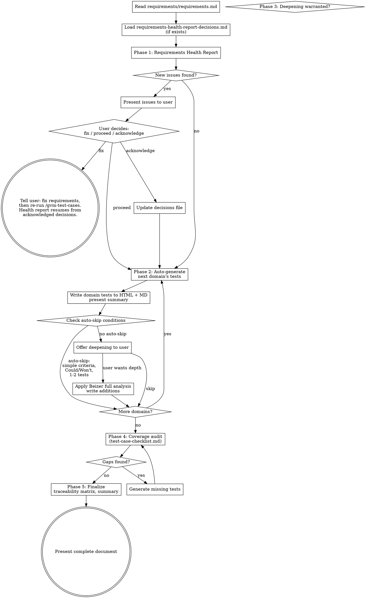

# Test Case Generation

## Overview

Generates structured test cases from a requirements document. Reads the output of `/gvm-requirements`, assesses requirements quality, then produces a comprehensive test suite through a hybrid auto-generate + conversational approach. Outputs paired HTML (Tufte/Few design) and Claude-friendly Markdown files, always in sync.

**This skill is a quality gate for requirements.** Before generating tests, it produces a health report that identifies untestable, inconsistent, or weak requirements. Issues are resolved or acknowledged before test generation proceeds. This skill generates test cases — it does not execute them, review code, or produce technical specifications.

**Shared rules:** At the start of this skill, load `~/.claude/skills/gvm-design-system/references/shared-rules.md` and follow all rules throughout execution. Load `~/.claude/skills/gvm-design-system/references/expert-scoring.md` when scoring experts.

## Hard Gates

1. **LOAD EXPERT REFERENCES AT SESSION START.** Read `~/.claude/skills/gvm-test-cases/references/test-design-techniques.md` and `~/.claude/skills/gvm-test-cases/references/test-case-checklist.md` BEFORE generating any test cases. If you write test cases without loading test design techniques, the output lacks methodological grounding.

2. **HEALTH REPORT BEFORE GENERATION.** Run the requirements health check BEFORE generating test cases. Present findings to the user. DO NOT skip the health report — upstream issues caught here prevent waste in downstream phases.

3. **WRITE MD THEN HTML BEFORE APPROVAL.** Write `test-cases/test-cases.md` first, then IMMEDIATELY write `test-cases/test-cases.html`. Both must exist before any approval checkpoint (shared rule 13).

4. **TRACEABILITY MATRIX IS MANDATORY.** The output must include a traceability matrix mapping every requirement ID to its test case IDs. If the matrix is missing, the output is incomplete and `/gvm-doc-review` cannot verify coverage.

**Pipeline position:** `/gvm-requirements` → **`/gvm-test-cases`** → `/gvm-tech-spec` → `/gvm-design-review (optional)` → `/gvm-build` → `/gvm-code-review` → `/gvm-test` → `/gvm-doc-write` → `/gvm-doc-review` → `/gvm-deploy`

**Prerequisite:** `requirements/requirements.md` must exist. If it does not, tell the user to run `/gvm-requirements` first.

**External test cases as seed:** If the user provides existing test cases from another tool or process (any format), read them and use them as seed input for the generation flow. Extract what maps to GVM test case structure (Given/When/Then, traceability to requirement IDs, priorities), flag gaps, and run the normal generation flow to produce GVM-quality output. The external tests accelerate the process but are not accepted as-is — they go through the same health report, technique selection, and coverage audit as generated tests. After the coverage audit (Phase 4), run the source verification loop (Phase 4b) to check completeness, accuracy, and hallucination against the original test document.

## Expert Panel

All expert definitions live in the reference file, not in this skill file. Use the Read tool to load `~/.claude/skills/gvm-test-cases/references/test-design-techniques.md` at the start of the session. The reference file defines the always-active experts (with roles: technique selection, thoroughness, output format, risk-based prioritisation) and includes a technique selection guide mapping requirement patterns to test design techniques. Follow the roles and techniques defined there.
Log all loaded experts to activation CSV (per shared rule 1).

**Industry domain specialists (Tier 2b):**

When generating test cases, check whether the application's business domain has an industry domain reference file in `~/.claude/skills/gvm-design-system/references/industry/`. If a matching file exists, load it with the Read tool. Industry domain experts inform test case generation in ways the software testing experts cannot — they know the domain-specific edge cases, regulatory scenarios, boundary conditions, and failure modes that matter in the real world. For example, a credit risk application needs tests for rating migration boundary conditions that Altman's framework defines; a market risk system needs stress scenarios that Jorion's framework prescribes.

## Process Flow

Before Phase 1: Bootstrap GVM home directory per shared rule 14.



## Phase Details

### Phase 1 — Requirements Health Report

Read `requirements/requirements.md` in full. If `test-cases/requirements-health-report-decisions.md` exists, load it to filter previously acknowledged issues.

Use the Read tool to load `~/.claude/skills/gvm-test-cases/references/test-design-techniques.md` if not already loaded (needed for risk assessment and testability criteria from the expert panel).

**Assess each requirement for:**

- **Untestable requirements** — vague language ("user-friendly", "fast", "intuitive"), missing acceptance criteria, no measurable outcome. Suggest how to make each testable.
- **Inconsistencies** — contradictions between requirements (e.g., conflicting constraints, overlapping scope with different specifications).
- **Weak requirements** — implementation details disguised as requirements, duplicates, overly broad statements that should be decomposed.
- **Missing coverage** — gaps where a requirement is implied but absent (error handling, empty states, edge flows, what happens when things go wrong).

**Write the health report before presenting.** Write the findings to `test-cases/requirements-health-report.html` (Tufte/Few design) and `test-cases/requirements-health-report.md` before presenting issues to the user. The user needs a readable reference — especially if they choose "Fix" and return to `/gvm-requirements` in a different session. The HTML report is the document they open to see what needs fixing.

**Present issues using AskUserQuestion.** After writing the report, present each issue (or batch of related issues) as a structured question using the AskUserQuestion tool, with options like "Fix first", "Proceed", "Acknowledge". For batches of similar low-severity issues, offer a single "Acknowledge all" option. The user answers via the Claude Code question UI, one question at a time.

**Option definitions:**
- **Fix** — tell the user to fix the upstream issue. When the user returns to `/gvm-test-cases`, the skill re-reads `requirements/requirements.md` and reloads `requirements-health-report-decisions.md` to skip previously acknowledged issues. No other state carries over — restart from the top of Phase 1.
- **Acknowledge** — record the issue in `test-cases/requirements-health-report-decisions.md` and continue to Phase 2. The issue will not be re-surfaced in future runs.
- **Proceed** — continue to Phase 2 without recording. The issue may be re-surfaced in future runs.

Previously acknowledged issues are shown as a count ("3 previously acknowledged issues skipped") but not re-surfaced unless the underlying requirement text has changed.

### Phase 2 — Auto-Generate First Pass (per domain)

For each domain in the requirements document:

1. Read just that domain's section from `requirements/requirements.md`. If the requirements document has no functional domains (only non-functional), skip to Phase 4 and note zero test coverage — recommend the user add functional requirements. If there are many domains (10+), batch progress updates to avoid overwhelming the conversation.
2. Apply the technique selection guide from the expert panel based on requirement patterns:
   - Conditional logic → decision table testing
   - Workflows/navigation → state transition testing
   - User actions with outcomes → use case testing
   - Data inputs with ranges → equivalence class + boundary value
   - Multiple interacting parameters → pairwise testing
   - Reversible, idempotent, or order-preserving operations → property-based testing (MacIver)
   - Calculations with algebraic properties → property-based testing (MacIver)
   - Accepts user input, renders content, handles files → security testing (OWASP)
   - Exposes API endpoints, manages auth/sessions → security testing (OWASP)
   - Simple declarative → single Given/When/Then scenario
3. Generate happy path + obvious negative cases (not full depth)
4. **EBT-1 example-based emission (ADR-501, ADR-502).** For every **MUST**
   priority requirement, emit at least one `[EXAMPLE]`-tagged test in the
   ADR-502 three-element shape — every element is required, no exceptions:

   ```
   TC-RE-X-NN: <descriptive name> [EXAMPLE]
   Input: <concrete value>
   Given <precondition>
   When <action with input>
   Then the output MUST contain: <token | phrase | structural element>
   And the output MUST NOT contain: <counterexample token | phrase>
   [Requirement: RE-X] [Priority: MUST]
   [Trace: G-J → A-K → I-M → D-N → RE-X → TC-RE-X-NN]
   ```

   The `Input:` line, the `MUST contain` line, and the `MUST NOT contain`
   line are all mandatory — Phase 4's EBT-1 audit (ADR-501) checks for
   each one verbatim and fails the requirement closed if any is absent.
   When the counterexample is ambiguous, ask the practitioner via
   AskUserQuestion ("What value should the output NOT contain?") rather
   than emit `<to-be-defined>` silently.

5. **Property-detection emission (ADR-507).** Load the heuristic via
   `_property_detection.load_property_detection()` from
   `~/.claude/skills/gvm-test-cases/scripts/_property_detection.py`
   (heuristic content lives in
   `~/.claude/skills/gvm-test-cases/references/property-detection.md`).
   For each requirement, call `heuristic.matches(requirement_text +
   grounding_sidenote_text)`. The matcher returns a tuple of category
   names (`idempotence`, `round_trip`, `ordering`, `algebraic`,
   `constraint_preservation`).

   - **Non-empty match** → emit one `[PROPERTY]`-tagged test using the
     matching category's template from `test-design-techniques.md`
     (MacIver section), in addition to the `[EXAMPLE]` test above.
   - **Empty match** → do **not** emit a `[PROPERTY]` test. EBT-7 is
     conditional, not pro-forma; Phase 4 audit does not fault the
     absence of `[PROPERTY]` for non-property requirements.

   For requirements matching security patterns (user input, API endpoints,
   auth, file handling): emit `[SECURITY]` tests per
   `test-design-techniques.md` OWASP section. Security tests are
   mandatory for MUST/SHOULD requirements with web or API exposure.

6. **Trace emission (ADR-505).** Append a `[Trace: ...]` line to every
   emitted test using
   `_trace_resolver.resolve_from_requirement_line(requirement_line,
   requirement_id, impact_map)`. The function returns `Trace | None`:

   - **Non-None return** → call
     `_trace_resolver.format_trace(trace, test_case_id)` to produce the
     `[Trace: G-J → A-K → I-M → D-N → RE-X → TC-RE-X-NN]` line.
   - **None return** (the requirement has no `[impact-deliverable: ...]`
     tag) → emit the literal line `[Trace: not-yet-traced]` and **do not**
     call `format_trace`. Surface the count of `not-yet-traced` lines to
     the user in Phase 4. Transitional projects need the path; this is
     not a hard fail.

7. **Contract / collaboration tagging (ADR-503).** When a test exercises
   a real production class downward from the DI root with mocks only at
   the external boundary, tag it `[CONTRACT]`. When a test verifies a
   caller invokes its collaborator with the expected arguments (mock or
   stub allowed), tag it `[COLLABORATION]`. Phase 4's
   `_ebt_contract_lint` enforces the structural rules — never embed an
   internal-class mock in a `[CONTRACT]` test, and never patch HTTP
   transport (`requests`, `httpx`, `axios`, etc.) inside the consumer's
   test.

8. Format example-based tests as Given/When/Then (using the output format expert's conventions) with:
   - Test case ID: `TC-{REQ-ID}-{NN}` (e.g., TC-RE-1-01)
   - Descriptive name (behaviour, not mechanism)
   - Concrete values (not abstract descriptions)
   - Requirement traceability tag
   - Priority (inherited from requirement, adjustable)
9. Write to both HTML + MD
10. Present summary: test names, counts, any flags (note how many
    `[PROPERTY]` tests were emitted, how many requirements got
    `[Trace: not-yet-traced]`).

### Phase 3 — Conversational Deepening (selective)

**First, check auto-skip conditions.** If any apply, skip directly to the next domain without offering deepening to the user. Only offer deepening if none of the auto-skip conditions are met.

**Auto-skip deepening when:**
- Requirement has simple, unambiguous acceptance criteria
- Only 1-2 test cases generated
- Requirement is Could or Won't priority

**Offer deepening when:**
- Requirement involves data inputs with ranges or boundaries
- Multiple conditions interact (decision table territory)
- Requirement is Must or Should priority
- First pass generated 4+ test cases (signals complexity)

When offering deepening, use the AskUserQuestion tool with options like "Deepen both", "Deepen [area] only", "Skip deepening". Summarise what deepening would add in the option descriptions.

When deepening, apply the thoroughness expert's full analysis:
- Rigorous boundary value analysis (min, min-1, min+1, max-1, max, max+1)
- Complete equivalence partitioning (valid + invalid + special values)
- Error guessing heuristics
- Add traditional-format detail for complex scenarios (preconditions, steps, expected results, test data)

Write additions to both HTML + MD.

### Phase 4 — Coverage Audit

Use the Read tool to load `~/.claude/skills/gvm-test-cases/references/test-case-checklist.md`.

- Build the traceability matrix: every requirement ID → its test case IDs
- Flag requirements with zero test coverage
- Flag orphan tests (tests not traced to a requirement)
- Apply the risk prioritisation expert's lens: are the right things tested? Are Must requirements thoroughly covered?
- Probe any gaps with the user

**Phase 4 sub-step — EBT-1 audit (ADR-501).** Before calling the
validator, verify both source files exist:
`requirements/requirements.md` and `test-cases/test-cases.md`. If
`requirements/requirements.md` is missing, abort Phase 4 and tell the
user to run `/gvm-requirements` first. If `test-cases/test-cases.md`
is missing, abort Phase 4 and tell the user no tests have been
generated yet (Phase 2 did not produce output). Then call
`_ebt_validator.audit(test_cases_path="test-cases/test-cases.md",
requirements_path="requirements/requirements.md")` from
`~/.claude/skills/gvm-test-cases/scripts/_ebt_validator.py`. The
validator walks the requirements index, filters to **MUST** priority,
and reports `coverage_gaps: tuple[CoverageGap, ...]`. Each
`CoverageGap` names a `missing` reason: `any-test`, `example-test`,
or `negative-assertion`. (Trace integrity is checked in a separate
sub-step below — it is not emitted as a `CoverageGap`.) For every gap,
present an AskUserQuestion with three options:

- **"Generate example test now"** — emit a fresh `[EXAMPLE]` block in
  ADR-502 shape (Input + MUST contain + MUST NOT contain) and re-run the
  audit.
- **"Mark requirement as exempt with rationale"** — record the
  exemption in `test-cases/requirements-health-report-decisions.md`
  with reason and date.
- **"Defer to next round"** — record as a known gap, surface in the
  Phase 5 summary.

Empty `coverage_gaps` = pass.

**Phase 4 sub-step — contract / collaboration lint (ADR-503, ADR-504,
ADR-508).** For every test file under the project's test root:

1. Compute the source root for that file by calling
   `_ebt_contract_lint.detect_source_root(test_file_path, stack)` (per
   ADR-504 — Python: `pyproject.toml` / `setup.py`; TS: `tsconfig.json`
   `rootDir`; Go: `go.mod`). If detection returns `None`, pass `None`
   forward — the lint runs in fail-closed mode (any non-allowlisted
   import is treated as internal).
2. Call
   `_ebt_contract_lint.lint(test_file_path, ebt_boundaries_path,
   source_root, stack=<detected stack>)` from
   `~/.claude/skills/gvm-design-system/scripts/_ebt_contract_lint.py`
(the same shared helper `/gvm-code-review` Panel B reuses — DRY, one
heuristic, two callers). The function returns a
`list[LintViolation]`; each violation has `kind` ∈ {`rainsberger`,
`metz`} and a `file_line` pointer. Compose the populated audit report
via `dataclasses.replace(report,
rainsberger_violations=tuple(rainsberger_list),
metz_violations=tuple(metz_list))` — `AuditReport` is `frozen=True`, so
direct mutation is impossible; `audit()` always returns the violation
tuples as `()` and the Phase 4 caller is responsible for populating
them. After composing, surface the violations to the user.

- **Rainsberger violations** — HTTP transport patched in the consumer
  (e.g., `patch("requests.get")`, `vi.mock("axios")`, raw URL outside
  `httptest.New`). Move the test to a contract test against a real
  fake server, or mark `[COLLABORATION]` if the boundary is genuinely
  internal.
- **Metz violations** — internal-class mock inside a `[CONTRACT]`
  test. Replace the mock with the real production class, or extend the
  project's `.ebt-boundaries` allowlist if the dependency is legitimately
  external from this project's perspective (per ADR-504).

Boundary patterns are loaded from the project's `.ebt-boundaries` file
(at `<project-root>/.ebt-boundaries`); when missing, the lint falls
back to stack defaults from
`~/.claude/skills/gvm-design-system/references/ebt-boundaries-defaults.md`.

**Phase 4 sub-step — trace integrity (ADR-505).** Confirm every
`[Trace: ...]` line resolves through the impact-map. First check that
`impact-map/impact-map.md` exists; if it does not, treat every test
case as carrying `[Trace: not-yet-traced]`, surface the count to the
user, and recommend running `/gvm-impact-map` — do not attempt to
resolve. Otherwise, for each test case with a non-`not-yet-traced`
line, look up the source requirement line in
`requirements/requirements.md` and call
`_trace_resolver.resolve_from_requirement_line(requirement_line,
requirement_id, impact_map)` — the same call Phase 2 used. A
`BrokenTraceError` (a parent FK that fails to resolve) is a hard gap;
surface to the user with the missing link ID. Lines emitted as
`[Trace: not-yet-traced]` are counted, not blocked: report the count
and recommend running `/gvm-impact-map` if it exceeds zero.

### Phase 4b — Source Verification (external test case seeds only)

When test cases were derived from an external document, run the source verification protocol defined in `~/.claude/skills/gvm-design-system/references/source-verification.md`. Use `artefact_type=test case`, `artefact_plural=test cases`, fourth check = **Traceability**. Follow the resolution pattern and repeat threshold from the shared reference.

### Phase 4c — Retrofit existing test-cases (ADR-506, EBT-6)

This sub-step is **opt-in** and runs only when the practitioner explicitly
invokes retrofit mode (e.g. by selecting "Retrofit existing test-cases" at
the Phase 1 prompt or by invoking `/gvm-test-cases --retrofit`). It is the
mechanism by which legacy projects backfill `[EXAMPLE]`-shaped tests for
MUST requirements that the original test pass missed.

When retrofit mode is active:

1. From the project root, run:

   ```
   python -m _retrofit \
       --requirements requirements/requirements.md \
       --test-cases   test-cases/test-cases.md
   ```

   Resolve the script via `~/.claude/skills/gvm-test-cases/scripts/_retrofit.py`
   (the module exposes a `__main__` block).

2. The script reuses `_ebt_validator.audit()` to identify every MUST
   requirement that lacks an example-based test, then emits one
   `RetrofitCandidate` per gap with a draft `[EXAMPLE]` block (Input +
   suggested positive + suggested negative + rationale). The candidate is
   a **draft, not a final test** — the practitioner must edit each block
   in-place, supplying real input values, real positive assertions, and
   real counterexamples grounded in the requirement.

   If the candidate list is empty (every MUST requirement already has an
   example-based test), inform the practitioner that retrofit is a no-op
   for this project and exit retrofit mode without proceeding to step 3.

3. For every candidate, present an AskUserQuestion with two options:
   - **"Accept and edit in-place"** — copy the draft block into
     `test-cases/test-cases.md`, then prompt the practitioner to refine
     the placeholder values until the assertions reflect the requirement.
   - **"Skip — gap remains"** — leave the requirement unretrofit and
     re-flag in the next `/gvm-code-review` Panel B run.

4. After all candidates are resolved, re-run the EBT-1 audit to confirm
   `coverage_gaps` reports zero `missing="example-test"` entries for MUST
   requirements. This is the EBT-6 acceptance condition (TC-EBT-6-01).

5. Commit the retrofitted test-cases with message
   `feat: EBT-6 retrofit — example-based tests for MUST requirements`.

Retrofit is a one-time pass per project. After it completes, normal
`/gvm-test-cases` runs go straight to Phase 5.

### Phase 5 — Finalize

1. Write traceability matrix to both documents
2. Write test summary: total counts by priority, coverage percentage, technique usage
3. Final sync check between HTML and MD
4. Log cited experts to activation CSV (per shared rule 1).
5. Present completed document for approval

## Input

Reads `requirements/requirements.md` from the current project. If the file doesn't exist, tell the user to run `/gvm-requirements` first.

## Output

**Files saved to `test-cases/` directory in the current project:**
- `test-cases/requirements-health-report.html` — Requirements health report (Tufte/Few design, written in Phase 1)
- `test-cases/requirements-health-report.md` — Health report in markdown
- `test-cases/requirements-health-report-decisions.md` — Persisted health report acknowledgements
- `test-cases/test-cases.html` — Tufte/Few styled (uses shared design system)
- `test-cases/test-cases.md` — Claude-friendly for `/gvm-build`

**requirements-health-report-decisions.md format:** One entry per acknowledged issue: `{requirement-ID} | {issue-type} | {disposition: Acknowledge/Proceed} | {date} | {round}`. One line per entry, append-only.

## Document Structure

Both HTML and MD follow this order:

1. **Expert Panel** — table of experts active during creation: Expert, Work, Role in This Document (per shared rule 17 and pipeline-contracts.md)
2. **Requirements Health Report** — issues found, decisions made, acknowledged items
3. **Test Suite Overview** — total count, breakdown by priority, techniques applied
4. **Test Cases by Domain** — grouped to match requirements document structure:
   - Domain header
   - Given/When/Then test cases (standard format)
   - Traditional detail blocks (complex scenarios only)
   - Each test tagged with ID, priority, requirement traceability
5. **Traceability Matrix** — requirement ID → test case IDs, coverage status
6. **Test Summary** — coverage percentage, risk notes, acknowledged gaps

## Test Case Formats

**Standard (Given/When/Then):**
```
TC-RE-1-01: Candidate areas match budget constraint
  Given a user with a maximum purchase price of $500,000
  And seeking single family homes
  And a maximum commute time of 45 minutes
  When the system identifies candidate areas
  Then 3-5 geographic areas are returned
  And each area has properties within the budget
  [Requirement: RE-1] [Priority: MUST]
```

**Complex (traditional detail added):**
```
TC-RE-2-03: Property listing price at budget boundary
  Given a user with a maximum purchase price of $500,000
  When the system searches for properties in a candidate area
  Then only properties at or below $500,000 are included

  Preconditions:
    - Candidate area has been identified (TC-RE-1-01 passes)
    - Property portal data is available for the area

  Steps:
    1. Set maximum purchase price to $500,000
    2. Query properties in candidate area
    3. Verify each returned property's asking price

  Expected Results:
    - Property at $500,000: included
    - Property at $499,999: included
    - Property at $500,001: excluded
    - Property with no price listed: excluded with note

  Test Data: boundary values from Beizer analysis
  [Requirement: RE-2] [Priority: MUST]
```

## Priority Inheritance

- Happy path tests inherit the requirement's MoSCoW priority
- Edge case / boundary tests may be deprioritized one level (Must → Should, Should → Could)
- The skill notes when it deprioritizes and why
- Priority can be adjusted during conversational review

## HTML Design

**HTML generation:** For each domain section: after writing that domain's MD test cases, dispatch HTML generation as a Haiku subagent (`model: haiku`). Do not wait for the full test-cases.md to be complete. Per shared rule 22.

Uses the shared design system. Use the Read tool to load `~/.claude/skills/gvm-design-system/references/tufte-html-reference.md` before the first HTML write.

Additional HTML patterns specific to test cases:

**Test case block:**
```html
<div class="test-case">
  <div class="tc-id">TC-RE-1-01 <span class="priority must">Must</span></div>
  <div class="tc-name">Candidate areas match budget constraint</div>
  <div class="tc-bdd">
    <p><strong>Given</strong> a user with a maximum purchase price of $500,000</p>
    <p><strong>And</strong> seeking single family homes</p>
    <p><strong>When</strong> the system identifies candidate areas</p>
    <p><strong>Then</strong> 3-5 geographic areas are returned</p>
  </div>
  <div class="tc-trace">Requirement: RE-1</div>
</div>
```

The CSS for test case components (`.test-case`, `.tc-id`, `.tc-name`, `.tc-bdd`, `.tc-trace`, `.tc-detail`, `.health-issue`) is included in `tufte-html-reference.md` (the `/* Test Case Components */` CSS block). Use the full shared CSS from that reference — it includes both the base design system and test-case-specific classes.

## Markdown Design

Mirrors HTML content exactly:
- Test cases formatted with Given/When/Then as indented text
- Traditional detail in nested bullet lists
- Priority shown as `**[MUST]**`, `**[SHOULD]**`, `**[COULD]**`, `**[WONT]**`
- Traceability as `[Requirement: RE-1]`
- Traceability matrix as a markdown table
- Health report issues as blockquotes with status markers

## Change Detection and Stale Handling

Before generating, check the state of existing artefacts.

### No existing test cases
Proceed with normal flow (Phase 1 onward).

### Existing test cases, requirements updated in place
Use Bash to compare timestamps: `python3 -c "import os; print(int(os.path.getmtime('requirements/requirements.md')))"` vs `python3 -c "import os; print(int(os.path.getmtime('test-cases/test-cases.md')))"`. If requirements are newer:
- Notify the user: "Requirements have been updated since test cases were last generated."
- Read the Changelog section of `requirements.md` to identify what changed.
- Re-run the health report (Phase 1) to catch new issues from changes.
- For each changed requirement (identified from changelog), regenerate or update its test cases.
- Preserve test cases for unchanged requirements.
- Add Changelog entries to `test-cases.md` for every modification (per shared rule 11).
- Previously acknowledged health report decisions remain valid unless the underlying requirement text changed.

### New requirements round detected
If `requirements-002.md` (or higher) exists without corresponding test cases:
- Tell the user: "New requirements round detected. Generating test cases for the new round."
- Create `test-cases-002.md` and `test-cases-002.html` (or next number).
- Test case IDs follow the round prefix from requirements: `TC-R2-{DOMAIN}-{N}-{NN}`.
- The traceability matrix maps new-round requirement IDs to new test case IDs.
- Previous round's test cases are immutable (Keeling).
- Run the normal flow (Phase 1 onward) reading only the new requirements document.

## Context Window Management

- Read `requirements/requirements.md` in full once for the health report (Phase 1)
- For Phase 2, read only the relevant domain section, not the whole file again
- Use the Read tool to load `~/.claude/skills/gvm-test-cases/references/test-design-techniques.md` once before Phase 1 (needed for health report AND Phase 2 technique selection)
- Use the Read tool to load `~/.claude/skills/gvm-design-system/references/tufte-html-reference.md` once before first write
- Use the Read tool to load `~/.claude/skills/gvm-test-cases/references/test-case-checklist.md` once before Phase 4
- Write sections incrementally per shared rule 18 — scaffold first, then one domain's test cases per Edit operation
- Use Edit tool to modify sections, not Write tool to rewrite files
- Present summaries for confirmation, not full HTML/MD echo
- Reference test case IDs rather than re-reading full test text

## Key Rules

1. **Health report before test generation** — always assess requirements quality first
2. **Every test traces to a requirement** — no orphan tests
3. **Every requirement gets at least one test** — gaps are flagged
4. **Concrete values, not abstractions** — "Given a budget of $500,000" not "Given a valid budget"
5. **Behaviour-focused names** — "Candidate areas match budget constraint" not "Test RE-1"
6. **Paired HTML and MD output** — per shared rule 13.
7. **Respect acknowledged decisions** — don't re-ask about previously accepted health report items
8. **Smart deepening** — only offer when warranted, auto-skip for simple/low-priority
9. **Priority inheritance with flexibility** — edge cases can be deprioritized, noted transparently
10. **Expert discovery for uncovered domains** — per shared rule 2. Document discovered experts in the test cases output.
